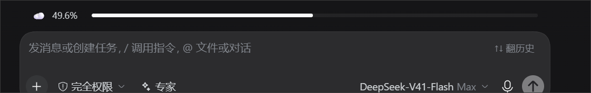

# Token Weather · DSH 上下文天气计

**在输入框正上方实时显示当前上下文窗口的使用率**，用天气图标 + 百分比 + 进度条呈现，一眼就能判断"是不是该压缩上下文了"。



> 实机截图：`☁️ 49.6%`（多云），进度条长度与输入框左右边缘对齐。

| 占用率 | 天气 |
|---|---|
| 0 – 30% | ☀️ 晴天 |
| 30 – 60% | ☁️ 多云 |
| 60 – 90% | 🌧️ 下雨 |
| ≥ 90% | ⛈️ 雷暴（转警告色，并提示「该压缩上下文了」） |

## 安装

**从 GitHub 直接安装**（无需 npm 账号）：

```bash
dsh plugin add github:EARTH-subo/dsh-token-weather
```

或者用 pnpm 装进 profile：

```bash
cd ~/.dsh/profiles/<你的 profile>
pnpm add github:EARTH-subo/dsh-token-weather
# 然后把 "dsh-token-weather" 加进 package.json 的 dsh.profile.bundles
```

装完**刷新页面**即可（客户端插件在页面加载时挂载），不需要重启宿主。

> 本仓库自带 `cordis.patch.yml`，并由 `package.json` 的 `dsh.bundle.patch` 声明——**这是挂载生效的关键**：只把包名写进 `dsh.profile.bundles` 并不会插入任何 Loader 条目，插件不会出现。

## 数据来源

读的是会话投影 `contextPressure`，由 `@deepseek-ai/dsh-token-meter` 注册，**不是自己估算的**：

```
占用率 = projectedTokens ÷ contextWindow
```

字段兼容顺序：`projectedTokens` → `pressureTokens` → `surfaceTokens`（旧版字段名）。

## 特性

- **实时**：订阅投影变化，随对话推进自动更新，无需刷新页面
- **风格一致**：配色全部取自 DSH 主题 token（`--dsw-alias-*`），自动跟随明暗主题
- **宽度对齐**：与输入框卡片左右边缘严格对齐（复用官方 `QueueDock` 的宽度公式）
- **切换顺滑**：进度条宽度带 `0.45s` 过渡，涨幅肉眼可见
- **不打扰**：90% 提示为**边沿触发**——每次越过 90% 只提醒一次，回落后重新武装，不会每帧刷屏
- **安全降级**：拿不到投影数据时显示 `0.0%`，绝不抛错、不影响输入框

## 实现要点

- **槽位**：`conversation.input.dock`（"输入框上方的满宽区域"，与官方 GoalBar / QueueDock 同槽位），`order: 15`
- **取数**：使用槽位的标准 prop `useProjection("contextPressure")`，与官方 `ContextMeter` 完全一致
- **客户端半边以经典脚本自注册**：`window.__ModuleLoader__.load({ id, factory })`，与官方客户端包产物格式相同。宿主**不编译插件**，因此必须交付已构建好的 `lib/client.js`。

## 兼容性

- 需要在 profile 里**挂载为 bundle**。包内自带 `cordis.patch.yml`，并由 `package.json` 的 `dsh.bundle.patch` 声明——这一步是关键：**只把包名写进 `dsh.profile.bundles` 并不会插入任何 Loader 条目**，插件不会生效。
- 依赖 DSH 客户端提供 `conversation.input.dock` 槽位与 `contextPressure` 投影。若未来版本投影字段改名，本插件会退回显示 `0.0%`（不报错），届时更新字段映射即可。

## 开发

仓库内 `test/` 是离线验证脚手架（**不在 npm 包内**）：

```bash
node test/hooks-order-check.mjs   # Rules of Hooks 回归（专抓 React #321 这类静默崩溃）
node test/structure-check.mjs     # 两条数据通路 × 四档天气 × 档位边界
node test/pack-check.mjs          # 发布物自洽性（files 白名单、无本地路径泄漏）
```

## 许可证

MIT © [EARTH-subo](https://github.com/EARTH-subo)
